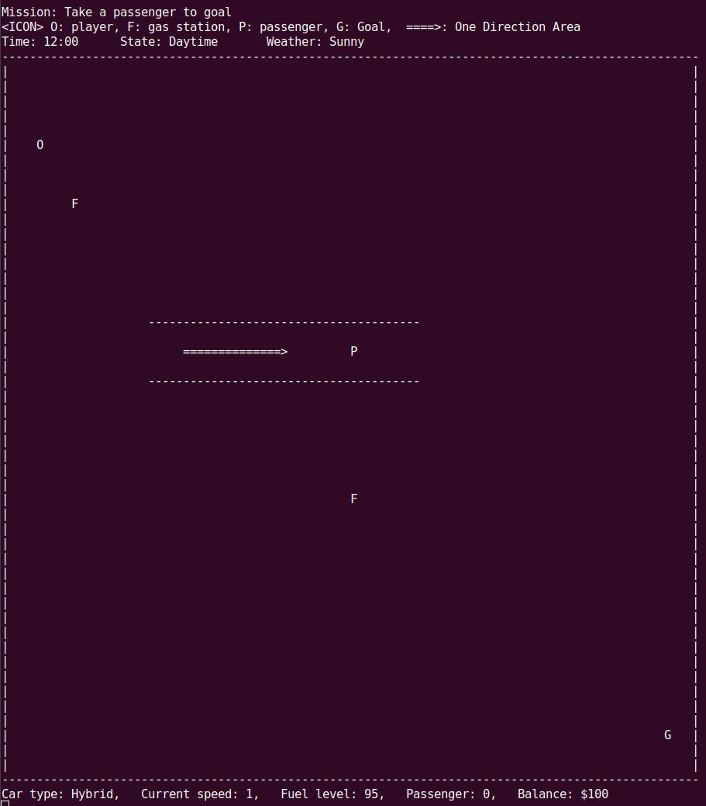

# テキストベースのドライブアドベンチャーゲーム
このプロジェクトは、C++で作成されたテキストベースのドライビングゲームです。
プレイヤーはコマンドを入力して地図の中を走行することができます。



## ゲームのルール
- プレイヤーはコマンドを入力して操作します。
- プレイヤーは車を操作し、街の中を移動します。
- ゲームの目的は、街の中にいる人をゴールまで届けることです。
- 最初にガソリンカーかハイブリッドカーを選択します。
- 雨のときは急ブレーキができません。
- 夜になると視界が悪化します。
- 一方通行エリアで逆走した場合、$50の罰金です。
- スピード超過の場合は$10の罰金です。
- ガソリンステーションは$20でガソリンを満タンにできます。

### ゲームクリアの条件
乗客(P)を車(O)に載せ、ゴール(G)まで届ければ、ゲームクリアです。

### ゲームオーバーの条件
- ガードレール(`|` または `-`)にぶつかる
- 所持金が0を下回る
- 燃料が切れる


## インストールと実行方法
1. プロジェクトのリポジトリをクローンします。
```bash
git clone https://github.com/koki-ota-woven/cpp-01-project-ja.git
```


2. プロジェクトのディレクトリに移動します。
```bash
cd cpp-01-project-ja
````


3. ソースコードをコンパイルします。
- GCCを使用する場合:
```bash
g++ -std=c++17 -o game src/main.cpp src/Player.cpp
```

- Clangを使用する場合:
```bash
clang++ -std=c++17 -o game src/main.cpp src/Player.cpp
```

- MinGWを使用する場合:
```bash
g++ -std=c++17 -o game.exe src/main.cpp src/Player.cpp
```


4. ゲームを実行します。
- macOS または Linux
```bash
./game
```

- Windows
```bash
my_program.exe
```


5. ゲームが起動し、コマンドの入力待ち状態になります。以下のコマンドを使って車を操作します。
   - `h`: 右に移動
   - `l`: 左に移動
   - `k`: 上に移動
   - `j`: 下に移動
   - `a`: 加速
   - `d`: 減速
   - `s`: 急ブレーキ 
   - `q`: ゲーム終了


6. ゲームを終了するには、`q` コマンドを入力します。


## プロジェクトにおける重要な設計やその設計理由
- コード作成の前から大きくプレイヤーのプログラムは分けられると考え、はじめからPlayer.cpp及びPlayer.hへとmain.cppから独立させてプログラムを作成した
- プレイヤーはインスタンスとして生成できるように簡単なクラスで実装した
- ベースとなる地図の情報をinitRace関数でまとめ、各所条件による地図の変化はベースに上書きするというロジックにした
- 常時動いている車の情報をユーザーの入力で更新するため、描画のスレッドとユーザーの入力を待つスレッドの２スレッドでプログラムを実装した


### 今後の改善ポイント
- 座標の情報を配列にしてまとめる
- main.cppが膨大なプログラムになってしまったので、DrawMap.cppのような別ファイルに地図作成のプログラムをまとめる