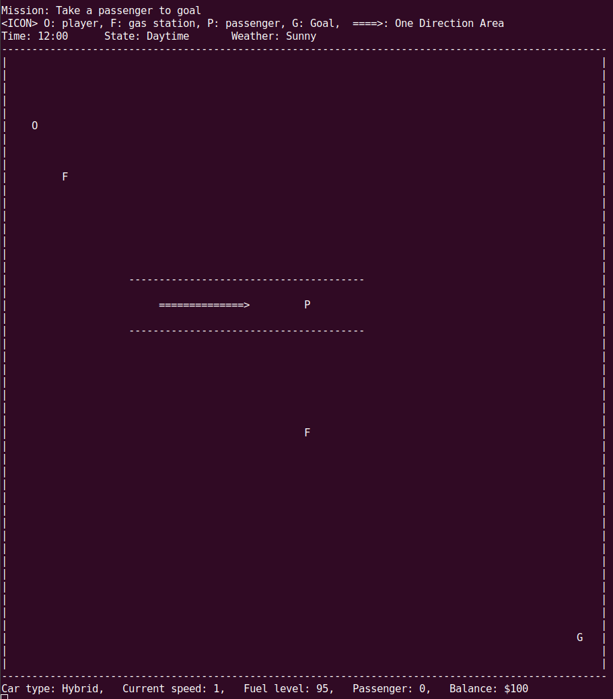

# テキストベースのドライブアドベンチャーゲーム
このプロジェクトは、C++で作成されたテキストベースのドライビングゲームです。プレイヤーはコマンドを入力して街の中を走行することができます。



## ゲームのルール
- プレイヤーはコマンドを入力して操作します。
- プレイヤーは車を操作し、街の中を移動します。
- ゲームの目的は、街の中にいる人をゴールまで届けることです。
- 最初にガソリンカーかハイブリッドカーを選択します。
- 雨のときは急ブレーキができません。
- 夜になると視界が悪化します。
- 一方通行エリアで逆走した場合、$50の罰金です。
- スピード釣果の場合は$10の罰金です。
- ガソリンステーションは$20でガソリンを満タンにできます。

### ゲームオーバーの条件
- ガードレール(`|` または `-`)にぶつかる
- 所持金が0を下回る
- 燃料が切れる

## インストールと実行方法
1. プロジェクトのリポジトリをクローンします。
```bash
git clone https://github.com/koki-ota-woven/cpp-01-project-ja.git
```


2. プロジェクトのディレクトリに移動します。
```bash
cd cpp-01-project-ja
````


3. ソースコードをコンパイルします。
- GCCを使用する場合:
```bash
g++ -std=c++17 -o game src/main.cpp src/Player.cpp
```

- Clangを使用する場合:
```bash
clang++ src/main.cpp src/Player.cpp -o game
```

- MinGWを使用する場合:
```bash
g++ -std=c++17 -o game.exe src/main.cpp src/Player.cpp
```


4. ゲームを実行します。
```bash
./game
```


5. ゲームが起動し、コマンドの入力待ち状態になります。以下のコマンドを使って車を操作します。
   - `h`: 画面右に動きます。
   - `l`: 画面左に動きます。
   - `k`: 画面上に動きます。
   - `j`: 画面下に動きます。
   - `a`: 加速します。
   - `d`: 減速します。
   - `s`: 緊急停止します。
   - `q`: ゲームを終了します。


6. ゲームを終了するには、`q` コマンドを入力します。
